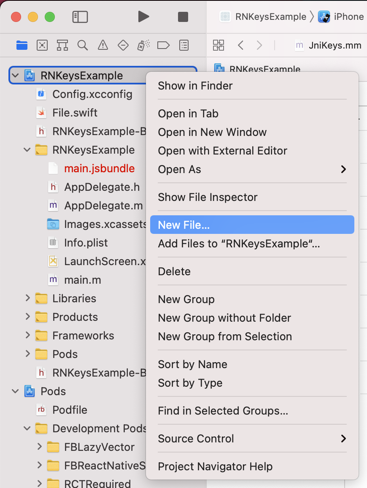
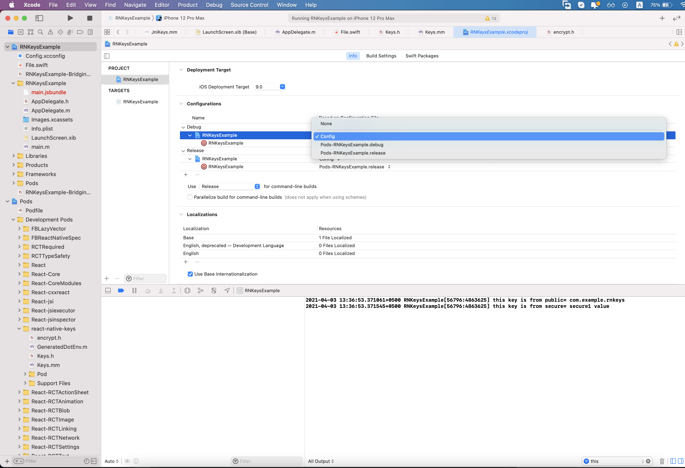
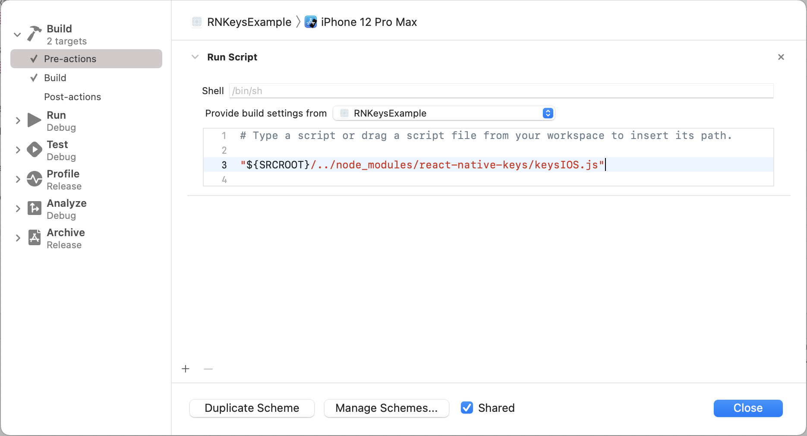

<div align="center">
  <h1 align="center">🔐 Make undecryptable .ENVs variables</h1>
</div>

### Why should we use react-native-keys over react-native-config?

We should use **react-native-keys** instead of **react-native-config** because **react-native-keys** gives guarantee of undecryptable **envs** whereas **react-native-config** **envs** can be decompile and hack
#### See the [ Migration from react-native-config](docs/react-native-config-migration-guide.md)

<div align="center">
    
</div>

Making undecryptable **Envs** library for React Native.

- 🔐 Made for **undecryptable** ENVs on react native apps
- 🗄️ Manage different enviroments (**dev**, **staging**, **production**)
- 🏎️ Up to 200x faster than all other solutions
- ⚡️ Lightning fast implementation with pure C++ and [**JSI**](https://github.com/react-native-community/discussions-and-proposals/issues/91) instead of the "old" Bridge
- 🧪 Well tested in JS and C++

We can Manage **secure**(undecryptable) and **public** enviroment through **react-native-keys** supporting **iOS** and **Android**

**secure:** Secure environment variables with the highest encryption which are undecryptable

**public:** Public environment variables are stored on the native side like Java and Objective-C which can decompile or hack.
**Note**: in public, we mostly store `Bundle Id`, `Package Id`, `App Name` or any other **AndroidManifest.xml** env

### Would you like to support me?

<div align="center">
<a href="https://github.com/numandev1?tab=followers">
    
</a>
<a href="https://twitter.com/numandev1/">
    
</a>
<a href="https://www.youtube.com/@numandev?sub_confirmation=1"><a/>
</br>
<a href="https://www.buymeacoffee.com/numan.dev" target="_blank"></a>
</div>

#### See the [How we are protecting ENVs on the app side?](docs/workflow.md)

## Installation

```sh
yarn add react-native-keys
```

## Basic Usage

Create a new file `keys.development.json` in the root of your React Native app and add Envs in `secure` object for `undecryptable` envs variables and add Envs in public for public usage this:

```json
{
  "secure": {
    "GOOGLE_API": "ABCD",
    "BRANCH_API": "ABCDEF"
  },
  "public": {
    "APP_NAME": "Keys Example",
    "BUNDLE_ID": "com.example.rnkeys.dev",
    "ANDROID_CODE": "50",
    "PACKAGE_ID": "com.example.rnkeys.dev"
  }
}
```

**Note: Dont forgot to follow other steps for **Android** and **IOS** to use these keys**

later on you can define other enviroment files like `keys.staging.json` and `keys.production.json`

## Javascript

### Public Keys

```js
import Keys from 'react-native-keys';

Keys.API_URL; // https://example.com'
Keys.URI_SCHEME; // fb://
```

### Secure Keys

```js
import Keys from 'react-native-keys';

Keys.secureFor('API_TOKEN'); // 'ABCSE#$DDSD
Keys.secureFor('GOOGLE_API_KEY'); // 'ABCSE#$DDSD
Keys.secureFor('SECRET_KEY'); // 'ABCSE#$DDSD
```

Keep in mind It's [basically impossible to prevent users from reverse engineering mobile app secrets](https://rammic.github.io/2015/07/28/hiding-secrets-in-android-apps/) but this library is more secure.

## Setup

Install the package:

```
$ yarn add react-native-keys
```

Link the library:

(Note: For React Native 0.60 or greater, [autolinking](https://reactnative.dev/blog/2019/07/03/version-60#native-modules-are-now-autolinked) is available)

or later. For earlier versions you need to manually link the module.)

```
$ react-native link react-native-keys
```

if cocoapods are used in the project then pod has to be installed as well:

```
(cd ios; pod install)
```

> **Note: If you get Undefined symbols \_BIO_f_base64 error during Xcode build then follow the below stackoverflow solution**
>
> Solution: [StackOverFlow](https://stackoverflow.com/a/76455587/8079868)

- Manual Link (iOS)

  1.  In XCode, in the project navigator, right click `Libraries` ➜ `Add Files to [your project's name]`
  2.  Go to `node_modules` ➜ `react-native-keys` and add `Keys.xcodeproj`
  3.  Expand the `Keys.xcodeproj` ➜ `Products` folder
  4.  In the project navigator, select your project. Add `Keys.a` to your project's `Build Phases` ➜ `Link Binary With Libraries`
  5.  And go the Build Settings tab. Make sure All is toggled on (instead of Basic)
  6.  Look for Header Search Paths and add `$(SRCROOT)/../node_modules/react-native-keys/ios/**` as `non-recursive`

- Manual Link (Android)

  **android/settings.gradle**

  ```diff
  + include ':react-native-keys'
  + project(':react-native-keys').projectDir = new File(rootProject.projectDir, '../node_modules/react-native-keys/android')
  ```

  **android/app/build.gradle**

  ```diff
  dependencies {
  	implementation "com.facebook.react:react-native:+"  // From node_modules
  +	implementation project(':react-native-keys')
  }
  ```

  **MainApplication.java**

  ```diff
  + import com.reactnativekeysjsi.KeysPackage;

  @Override
  protected List<ReactPackage> getPackages() {
  	   return Arrays.asList(
          		new MainReactPackage()
  +      		new KeysPackage()
      );
  }
  ```

## Native Usage

### Android

#### Public Keys

you can only read jni key into java file.like this

```java
URL url = new URL(BuildConfig.API_URL);  // https://example.com
```

You can also read them from your Gradle configuration:

```groovy
defaultConfig {
    applicationId project.keys.get("APP_ID")
}
```

And use them to configure libraries in `AndroidManifest.xml` and others:

```xml
<meta-data
  android:name="io.branch.sdk.BranchKey.test"
  android:value="@string/BRANCH_KEY" />
```

All variables are strings, so you may need to cast them. For instance, in Gradle:

```
versionCode project.keys.get("VERSION_CODE").toInteger()
```

#### Secure Keys (JNI)

```java
import static com.reactnativekeysjsi.KeysModule.getSecureFor;

String secureValue=getSecureFor("BRANCH_KEY");   // key_test_omQ7YYKiq57vOqEJsdcsdfeEsiWkwxE
```

### iOS

#### Public Keys

Read variables declared in `keys.development.json` from your Obj-C classes like:

```objective-c
// import header
#import "Keys.h"

// then read individual keys like:
NSString *value = [Keys publicFor:@"API_URL"];   // https://example.com

// or just fetch all keys
NSDictionary *allKeys = [Keys public_keys];
```

#### Secure Keys

```objective-c
// import header
#import "Keys.h"

// then read individual keys like:
NSString *value = [Keys secureFor:@"BRANCH_KEY"];   //key_test_omQ7YYKiq57vOqEJsdcsdfeEsiWkwxE
```

With one extra step environment values can be exposed to "Info.plist" and Build settings in the native project.

1. click on the file tree and create new file of type XCConfig
   
   
2. save it under `ios` folder as "Config.xcconfig" with the following content:

```
#include? "tmp.xcconfig"
```

3. add the following to your ".gitignore":

```
ios/tmp.xcconfig

```

4. go to project settings
5. apply config to your configurations
   
6. Go to _Edit scheme..._ -> _Build_ -> _Pre-actions_, click _+_ and select _New Run Script Action_. Paste below code which will generate "tmp.xcconfig" before each build exposing values to Build Settings and Info.plist. Make sure to select your target under _Provide build settings from_, so `$SRCROOT` environment variables is available to the script..

   ```
   "${SRCROOT}/../node_modules/react-native-keys/keysIOS.js"
   ```

   

7. You can now access your env variables in the Info.plist, for example `$(MY_ENV_VARIABLE)`. If you face issues accessing variables, please open a new issue and provide as much details as possible so above steps can be improved.

- Go to _Edit scheme..._ -> _Build_ -> _Pre-actions_, click _+_ and select _New Run Script Action_. Paste below code which will generate KEYS keys on native ios side (into node*modules) Make sure to select your target under \_Provide build settings from*, so `$SRCROOT` environment variables is available to the script.

```
"${SRCROOT}/../node_modules/react-native-keys/keysIOS.js"
```

### Different environments

Save config for different environments in different files: `keys.staging.json`, `keys.production.json`, etc.

By default react-native-keys will read from `keys.development.json`, but you can change it when building or releasing your app.

The simplest approach is to tell it what file to read with an environment variable, like:

```
$ KEYSFILE=keys.staging.json react-native run-ios           # bash
$ SET KEYSFILE=keys.staging.json && react-native run-ios    # windows
$ env:KEYSFILE="keys.staging.json"; react-native run-ios    # powershell
```

This also works for `run-android`. Alternatively, there are platform-specific options below.

#### Android

The same environment variable can be used to assemble releases with a different config:

```
$ cd android && KEYSFILE=keys.staging.json ./gradlew assembleRelease
```

Alternatively, you can define a map in `build.gradle` associating builds with env files. Do it before the `apply from` call, and use build cases in lowercase, like:

```
project.ext.keyFiles = [
  debug: "keys.development.json",
  release: "keys.staging.json",
]

apply from: project(':react-native-keys').projectDir.getPath() + "/RNKeys.gradle"
```

#### Advanced Android Setup

In `android/app/build.gradle`, if you use `applicationIdSuffix` or `applicationId` that is different from the package name indicated in `AndroidManifest.xml` in `<manifest package="...">` tag, for example, to support different build variants:
Add this in `android/app/build.gradle`

```
defaultConfig {
    ...
    resValue "string", "build_config_package", "YOUR_PACKAGE_NAME_IN_ANDROIDMANIFEST_XML"
}
```

if you are using `Proguard` then you should read [Problems with Proguard](#problems-with-proguard)

#### iOS

The basic idea in iOS is to have one scheme per environment file, so you can easily alternate between them.

Start by creating a new scheme:

- In the Xcode menu, go to Product > Scheme > Edit Scheme
- Click Duplicate Scheme on the bottom
- Give it a proper name on the top left. For instance: "Myapp (staging)"

Then edit the newly created scheme to make it use a different env file. From the same "manage scheme" window:

- Expand the "Build" settings on left
- Click "Pre-actions", and under the plus sign select "New Run Script Action"
- Where it says "Type a script or drag a script file", type:

you can also set different file for debug and release build like this.

```sh
// DEBUG_KEYSFILE will choose env file
export KEYSFILE=keys.production.json

// if you wannna use different keys for same scheme
export DEBUG_KEYSFILE=keys.debug.json  //in running metro
export RELEASE_KEYSFILE=keys.staging.json  // in IPA

#above DEBUG_KEYSFILE and RELEASE_KEYSFILE variable are optional

"${SRCROOT}/../node_modules/react-native-keys/keysIOS.js"
```

Also ensure that "Provide build settings from", just above the script, has a value selected so that PROJECT_DIR is set.

## Test Security

you can decompile **APK/IPA** by this package [react-native-decompiler](https://www.npmjs.com/package/react-native-decompiler 'react-native-decompiler') and can find public and secure keys. you will not find secure keys.

Troubleshooting

### Problems with Proguard

When Proguard is enabled (which it is by default for Android release builds), it can rename the `BuildConfig` Java class in the minification process and prevent React Native Keys from referencing it. To avoid this, add an exception to `android/app/proguard-rules.pro`:

    -keep class com.mypackage.BuildConfig { *; }

`com.mypackage` should match the `package` value in your `app/src/main/AndroidManifest.xml` file.

we can find BuildConfig file at `android/app/build/generated/source/buildConfig/debug/com.mypackage/BuildConfig.java`

If using Dexguard, the shrinking phase will remove resources it thinks are unused. It is necessary to add an exception to preserve the build config package name.

    -keepresources string/build_config_package

# Alternative Package

This package full alternative of [react-native-config](https://github.com/luggit/react-native-config) and [react-native-dotenv](https://github.com/goatandsheep/react-native-dotenv)

The above-mentioned packages do not provide any **security** for **environment variables** as well as these packages are not as fast as the **react-native-keys** package because it does not use JSI (JavaScript Interface).

## Consider supporting with a ⭐️ [star on GitHub](https://github.com/numandev1/react-native-keys/stargazers)

If you are using the library in one of your projects, consider supporting it with a star. It takes a lot of time and effort to keep this maintained and address issues and bugs. Thank you.

## Meta

Created by [Numan.dev](https://numan.dev/).
