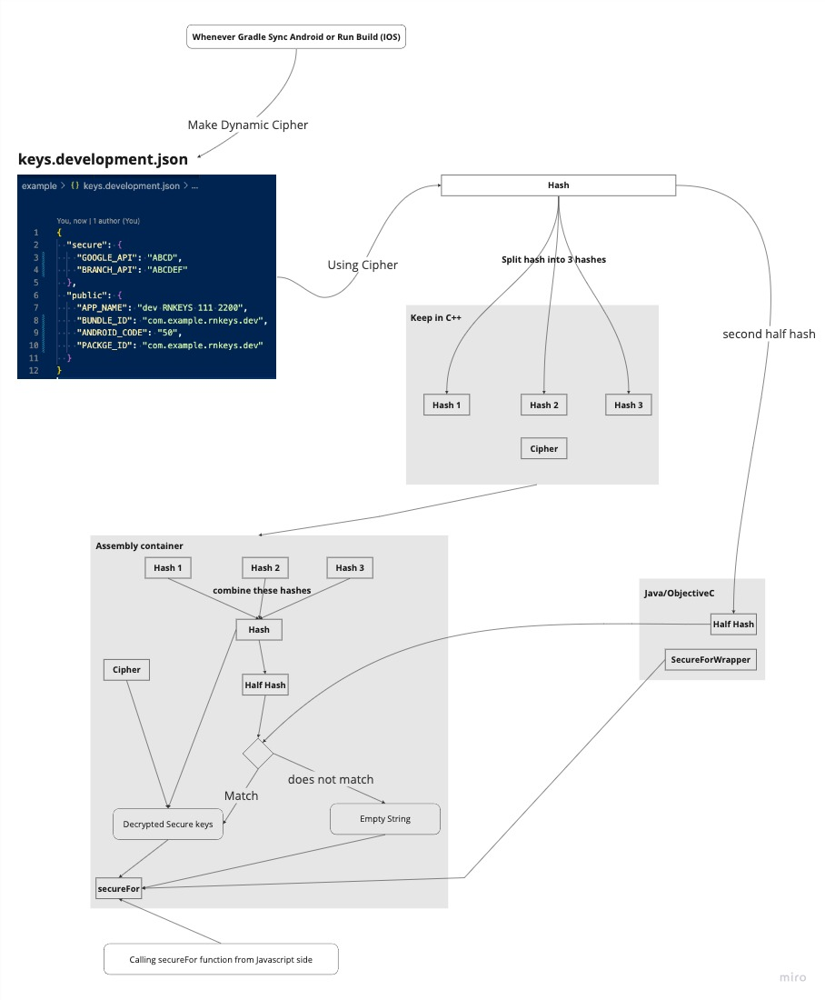

# If you are Hacker or Attacker then this challenge is for you

If you are a good attacker or hacker then here is APK: https://drive.google.com/file/d/1tx-NoU5LJzSw78x27wFDMgzw5c74qLkR/view?usp=sharing, I have stored the key name: `API_KEY_FOR_DECOMPILE`, can you try to decompile the value of this key

# How we are protecting ENVs on the app side?

    

We don't keep original secure keys anywhere like in Java, Objective-C, or javascript, we convert secure keys into multiple hashes using a dynamic [Ciper](https://en.wikipedia.org/wiki/Cipher) and keep these multiple hashes and [Ciper](https://en.wikipedia.org/wiki/Cipher) into C++ so during build it goes into assembly language not a Smali file, in assembly language it is very hard to extract multiple hashes, combine it and [Ciper](https://en.wikipedia.org/wiki/Cipher) and decrypt hashing using [Ciper](https://en.wikipedia.org/wiki/Cipher)

we are using dynamic [Ciper](https://en.wikipedia.org/wiki/Cipher) for encoding secure keys, which means we convert secure keys into hash by using [Ciper](https://en.wikipedia.org/wiki/Cipher) (you can say dynamic password) after getting hash we are splitting this hash into 3 parts (3 substrings or 3 chunks of hash) and save these 3 chunks of string in C++ different variables, for decoding we have to integrate 3 Chunks of hash strings generated from Ciper + have to open the lock using [Ciper](https://en.wikipedia.org/wiki/Cipher) for decoding original secure keys, we also save half of the hash on Java and Objective-C, whenever user call `secureFor` method, On java or Objective-C send this half key to C++ method which combine 3 chunks of hash string, divide into half of the hash and then match this the half key with being sent from java or Objective-C side if it matches then we decrypt the key from the hash and return the key from assembly(compiled c++)
**Note: Secure key comes into existence on runtime**

> It’s important to understand that no system is completely secure from attacks, even every wifi device or laptop password is also hackable, I made this for making a good security measurement for preventing 3rd party API key abuse, Good security measure is better than nothing to do
> Before using this package our 3rd party API key had a 99% hackable probability but after using this package hack probability will be 0.5%

as far as I know, we can abuse all types of 3rd parties unless that 3rd party uses

- DeviceCheck or App Attest for IOS
- Play Integrity or SafetyNet for Android
- or in one package firebase-appcheck supported both platform
